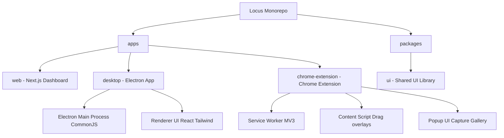

#  Locus - Smart Capture

Locus is a premium, high-fidelity capturing ecosystem. This repository is configured as a robust **pnpm monorepo** housing our cross-platform desktop capture helper, a feature-rich browser capture extension, and the central Next.js marketing and download dashboard.

---

## 🏗️ Project Architecture

Locus consists of three coordinated apps and one shared component library:



### Monorepo Workspaces
*   **`apps/desktop`**: A native cross-platform helper capturing monitors and window boundaries. Minimizes silently to system tray on startup using custom CommonJS packaging.
*   **`apps/chrome-extension`**: A powerful Chrome overlay. Supports viewport capture, manual drag croppers, and DevTools-style auto element border highlighting.
*   **`apps/web`**: Marketing dashboard built on Next.js.
*   **`packages/ui`**: Shared UI component library.

---

## 🛠️ Developer Setup & Installation

Follow these instructions to clone, configure, and boot the development environment:

### 1. Prerequisite Installations
*   Ensure **Node.js v20+** is installed on your local system.
*   Install **pnpm** globally:
    ```bash
    npm install -g pnpm
    ```

### 2. Clone the Repository
```bash
git clone https://github.com/lwshakib/locus-smart-capture.git
cd locus-smart-capture
```

### 3. Install Workspace Dependencies
```bash
pnpm install
```

### 4. Boot Development Servers
To boot all sub-workspaces concurrently:
```bash
pnpm dev
```
*   **Desktop App**: Launches the Vite hot-reloading dev client inside an Electron shell.
*   **Web App**: Launches local Next.js dev server at `http://localhost:3000`.
*   **Chrome Extension**: Compiles development assets inside `apps/chrome-extension/dist`.

---

## 📦 Building for Production

### 1. Code Quality & Lint Checks
Ensure all workspace code complies with style and type standards before committing:
```bash
pnpm lint
```

### 2. Production Bundling
Compile and build optimized packages for all projects:
```bash
pnpm build
```
*   **Web App**: Compiles standard production bundles inside `.next`.
*   **Chrome Extension**: Packs a zip installer inside `apps/chrome-extension/release/`.
*   **Desktop App**: Compiles Vite assets, maps Electron main modules to CommonJS, and triggers `electron-builder` to package platform installers inside `release/`.

---

## 📜 Contributing & Coding Standards
Locus enforces strict styling, type-safety, and behavior. Please refer to [CONTRIBUTING.md](file:///e:/locus-smart-capture/CONTRIBUTING.md) and our [CODE_OF_CONDUCT.md](file:///e:/locus-smart-capture/CODE_OF_CONDUCT.md) before submitting pull requests.
